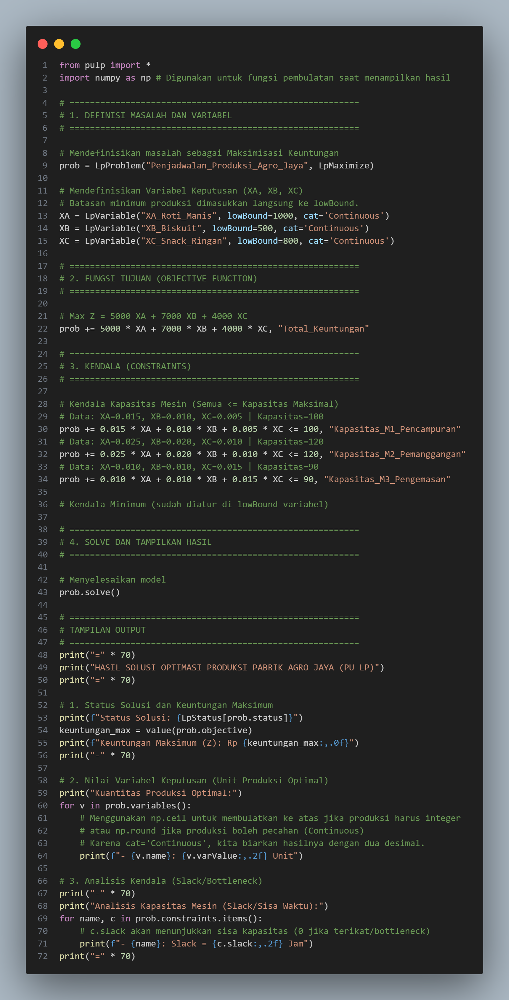
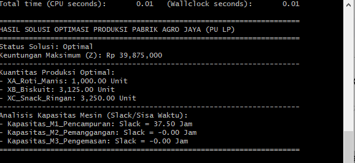

**LAPORAN PROYEK**

**Mata Kuliah Teknik Riset Oprasional**

<table>
<thead>
   	</tr>
		<tr>
		<th>Dosen Pengampu</th>
		<th>: AGUNG PERDANANTO S.Kom, M.Kom.</th>
	</tr>
    <tr>
		<th>DISusun Oleh</th>
		<th></th>
	</tr>
	<tr>
		<td>NAMA</td>
		<td>: Hertafianus Ge'e</td>
	</tr>
</thead>
<tbody>
	<tr>
		<td>NIM</td>
		<td>: 231011401257</td>
	</tr>
	<tr>
		<td>KELAS</td>
		<td>: 05TPLM009</td>
</tbody>
</table>

**TEKNIK INFORMATIKA**

**FAKULTAS ILMU KOMPUTER**

**UNIVERSITAS PAMULANG**

LAPORAN PROYEK\
TEKNIK RISET OPERASIONAL

Judul Proyek : Analisis dan Optimasi Penjadwalan Produksi Menggunakan
*Linear Programming* Guna Meningkatkan Efisiensi Waktu di Pabrik Makanan
Agro Jaya.

Disusun oleh : hertafianus Ge,e

NIM : 231011401257

Kelas : 05TPLM009

Dosen Pengampu : AGUNG PERDANANTO S.Kom, M.Kom

Program Studi : TEKNIK INFORMATIKA -- UNIVERSITAS PAMULANG

Tanggal Pengumpulan :

# PENDAHULUAN

## A. Latar Belakang Masalah

Efisiensi operasional merupakan kunci keberhasilan bagi industri
manufaktur, terutama di sektor makanan yang memiliki persaingan ketat
dan margin keuntungan yang sensitif terhadap biaya produksi. Pabrik
Makanan Agro Jaya menghadapi tantangan klasik dalam alokasi sumber daya:
bagaimana menentukan bauran produksi optimal untuk berbagai jenis produk
(Roti Manis, Biskuit, dan Snack Ringan) agar dapat memaksimalkan
keuntungan dan sekaligus meningkatkan efisiensi waktu kerja mesin yang
terbatas.

Proses penjadwalan produksi yang tidak optimal dapat menyebabkan
terjadinya *bottleneck* pada mesin kritis, pemanfaatan sumber daya yang
tidak merata, dan pada akhirnya, kerugian akibat waktu henti (*idle
time*) atau biaya lembur yang tidak perlu. Oleh karena itu, diperlukan
suatu pendekatan sistematis dan kuantitatif untuk menyelesaikan masalah
ini.

## B. Rumusan Masalah

Bagaimana memodelkan masalah penjadwalan produksi di Pabrik Makanan Agro
Jaya ke dalam model Program Linier (*Linear Programming*)?

Berapa kuantitas produksi optimal untuk masing-masing jenis produk yang
harus diproduksi dalam satu periode waktu guna memaksimalkan total
keuntungan perusahaan, dengan mempertimbangkan kendala kapasitas mesin
dan batasan permintaan pasar?

Bagaimana dampak perubahan kapasitas mesin (*bottleneck*) terhadap
profitabilitas dan efisiensi waktu, serta skenario optimal apa yang
dapat direkomendasikan?

## C. Tujuan Proyek

Tujuan yang ingin dicapai melalui proyek analisis dan optimasi ini
adalah:

Memformulasikan model matematika Program Linier untuk masalah alokasi
sumber daya dan penjadwalan produksi di Pabrik Makanan \'Agro Jaya\'.

Menemukan solusi penjadwalan produksi optimal menggunakan metode
komputasi (Python/PuLP) serta membandingkan hasilnya.

Melakukan analisis sensitivitas dan eksplorasi untuk mengidentifikasi
*bottleneck* dan memberikan rekomendasi strategis guna meningkatkan
efisiensi pemanfaatan waktu dan kapasitas mesin.

## D. Manfaat dan Ruang Lingkup

Proyek ini memberikan manfaat utama berupa solusi optimal yang langsung
meningkatkan efisiensi operasional Agro Jaya.

1.  Keputusan Produksi Tepat: Menghasilkan jadwal produksi yang pasti
    (XA​,XB​,XC​) yang memaksimalkan total keuntungan (Zmax​) perusahaan.

2.  Identifikasi Investasi Kritis: Menggunakan analisis *Shadow Price*
    untuk secara ilmiah mengidentifikasi Mesin *Bottleneck* yang
    membatasi keuntungan, sehingga keputusan investasi peningkatan
    kapasitas menjadi tepat sasaran.

3.  Efisiensi Waktu: Memastikan alokasi waktu mesin yang optimal,
    mengurangi waktu terbuang (*idle time*), dan secara keseluruhan
    meningkatkan efisiensi pemanfaatan sumber daya.

Proyek ini fokus pada pemodelan dan analisis pada lingkup terbatas agar
hasilnya spesifik dan terukur.

1.  Fokus Terbatas: Analisis hanya mencakup tiga jenis produk dan tiga
    pusat kerja/mesin utama di tahap produksi.

2.  Model *Linear Programming*: Menggunakan metode Program Linier (PL)
    sebagai kerangka pemodelan utama.

3.  Asumsi Data Pasti: Semua data input (waktu, biaya, kapasitas)
    diasumsikan pasti (*deterministik*) dan tidak mempertimbangkan
    faktor ketidakpastian (misalnya, kerusakan mesin atau fluktuasi
    permintaan).

4.  Alat Solusi: Solusi dicapai dan diverifikasi dengan perbandingan
    hasil antara Excel Solver dan Python (PuLP/SciPy).

# DESKRIPSI STUDI KASUS

## 1.1 Deskripsi singkat perusahaan/kasus

Pabrik Makanan Agro Jaya adalah perusahaan manufaktur makanan skala
menengah yang berlokasi di Jawa Barat. Perusahaan ini beroperasi dalam
lingkungan pasar yang kompetitif dan berupaya keras menjaga efisiensi
biaya operasional, terutama dalam proses produksinya. \'Agro Jaya\'
menggunakan sistem produksi *job-shop* di mana produk harus melewati
serangkaian mesin utama.

Manajemen Agro Jaya menyadari bahwa penjadwalan produksi yang ada saat
ini seringkali menghasilkan pemanfaatan mesin yang tidak merata dan
munculnya *bottleneck* yang tidak teridentifikasi, yang pada akhirnya
mengurangi total keuntungan mingguan. Oleh karena itu, perusahaan
mencari solusi optimal untuk alokasi produksi guna memaksimalkan
keuntungan dalam batasan jam kerja mesin yang tersedia.

Agro Jaya fokus pada tiga jenis produk utama dengan tingkat keuntungan
dan kebutuhan pemrosesan yang berbeda:

1\. Produk A (Roti Manis Premium): Memiliki margin keuntungan tertinggi,
tetapi membutuhkan waktu pemanggangan yang relatif lama.

2\. Produk B (Biskuit Hemat): Memiliki margin keuntungan sedang, dan
prosesnya seimbang di semua mesin.

3\. Produk C (Snack Ringan Cepat Saji): Memiliki margin keuntungan
terendah, tetapi waktu pemrosesannya sangat cepat di Mesin Pencampuran
dan Pengemasan.

## 1.2 Tabel Mesin dan Kapasitas

<table>
<thead>
	<tr>
		<th>Lokasi Sumber Daya (Mesin)</th>
		<th>Fungsi Utama</th>
		<th>Simbol Kendala</th>
		<th>Kapasitas Maksimal (Jam/Minggu)Mesin</th>
	</tr>
</thead>
<tbody>
	<tr>
		<td>Mesin M1</td>
		<td>Pencampuran Adonan</td>
		<td>Kendala 1</td>
		<td>100 Jam</td>
	</tr>
	<tr>
		<td>Mesin M2</td>
		<td>Pemanggangan</td>
		<td>Kendala 2</td>
		<td>120 Jam</td>
	</tr>
	<tr>
		<td>Mesin M3</td>
		<td>Pengemasan Akhir</td>
		<td>Kendala 3</td>
		<td>90 Jam</td>
	</tr>
</tbody>
</table>

Tabel ini mendefinisikan sumber daya utama (mesin) dan batas atas
(kendala) ketersediaan waktu. Nilai dalam kolom Kapasitas Maksimal akan
digunakan di sisi kanan (RHS) setiap pertidaksamaan kendala dalam model
Program Linier.

## 1.3 Tabel Produk dan Batasan Produksi

<table>
<thead>
	<tr>
		<th>Produk</th>
		<th>Variabel Keputusan</th>
		<th>Keuntungan/Unit</th>
		<th>Batasan Minimum Produksi (Unit/Minggu)</th>
	</tr>
</thead>
<tbody>
	<tr>
		<td>Produk A (Roti Manis)</td>
		<td>XA</td>
		<td>​Rp 5.000</td>
		<td>1.000 unit</td>
	</tr>
	<tr>
		<td>Produk B (Biskuit)</td>
		<td>XB</td>
		<td>​Rp 7.000</td>
		<td>500 unit</td>
	</tr>
	<tr>
		<td>Produk C (Snack Ringan)</td>
		<td>XC</td>
		<td>​Rp 4.000</td>
		<td>800 unit</td>
	</tr>
</tbody>
</table>

Kolom Keuntungan/Unit menjadi koefisien dalam Fungsi Tujuan (Maksimisasi
Z). Kolom Batasan Minimum Produksi akan menjadi kendala *lower bound*
(≥) yang menjamin perusahaan memenuhi komitmen dasar pasar.

## 1.4 Tabel Kebutuhan Waktu Produksi

<table>
<thead>
	<tr>
		<th>Kebutuhan Waktu (Jam/Unit)</th>
		<th>Mesin M1 (100 Jam)</th>
		<th>Mesin M2 (120 Jam)</th>
		<th>Mesin M3 (90 Jam)</th>
	</tr>
</thead>
<tbody>
	<tr>
		<td>Produk A</td>
		<td>0.015</td>
		<td>0.025</td>
		<td>0.01</td>
	</tr>
	<tr>
		<td>Produk B</td>
		<td>0.01</td>
		<td>0.02</td>
		<td>0.01</td>
	</tr>
	<tr>
		<td>Produk C</td>
		<td>0.005</td>
		<td>0.01</td>
		<td>0.015</td>
	</tr>
</tbody>
</table>

Data ini adalah koefisien teknologi yang menunjukkan tingkat konsumsi
waktu mesin oleh setiap produk. Nilai-nilai ini akan dikalikan dengan
Variabel Keputusan (Xi​) dan disajikan di sisi kiri (LHS) dari setiap
pertidaksamaan kendala kapasitas mesin.

# FORMULASI MATEMATIS

Model ini diformulasikan untuk menentukan jumlah unit dari Produk A, B,
dan C yang harus diproduksi dalam seminggu untuk **memaksimalkan total
keuntungan** perusahaan (Z), dengan kendala kapasitas jam mesin yang
tersedia.

## 1.1 Variabel Keputusan

Variabel Keputusan adalah output yang ingin kita cari nilainya, yaitu
kuantitas produksi mingguan untuk setiap produk:

XA​: Jumlah unit Produk A (Roti Manis) yang diproduksi.

XB​: Jumlah unit Produk B (Biskuit) yang diproduksi.

XC​: Jumlah unit Produk C (Snack Ringan) yang diproduksi.

## 1.2 Fungsi Tujuan

Tujuan perusahaan adalah Maksimisasi Keuntungan Total (Z). Koefisien
fungsi tujuan diambil dari kolom Keuntungan/Unit pada data studi kasus
(Tabel Produk dan Batasan Produksi).

Maksimalisasi Keuntungan (Z):

maxZ=5000XA​+7000XB​+4000XC​

## 1.3 Kendala

Kendala dibagi menjadi dua kategori utama: Kendala Kapasitas Mesin
(sumber daya terbatas) dan Kendala Permintaan Minimum (kewajiban pasar)

Kendala Kapasitas Mesin:

Kendala ini memastikan bahwa total waktu yang digunakan oleh semua
produk tidak melebihi kapasitas maksimal jam kerja mesin mingguan.
Koefisien diambil dari Tabel Kebutuhan Waktu Produksi.

\- Kendala Mesin M1 (Pencampuran):

0.015XA​+0.010XB​+0.005XC​≤100

\- Kendala Mesin M2 (Pemanggangan):

0.025XA​+0.020XB​+0.010XC​≤120

\- Kendala Mesin M3 (Pengemasan):

0.010XA​+0.010XB​+0.015XC​≤90

Kendala Permintaan Minimum

Kendala ini memastikan bahwa perusahaan memproduksi setidaknya jumlah
minimum yang telah ditetapkan untuk memenuhi permintaan dasar pasar.

-   Kendala Produk A:

> XA​≥1000

-   Kendala Produk B:

> XB​≥500

-   Kendala Produk C:

> XC​≥800

## 1.4 Kendala Non-Negatif

Kuantitas produk yang diproduksi tidak boleh negatif.

XA​,XB​,XC​≥0

## 1.5 Ringkasan Model Program Linier

<table>
<thead>
	<tr>
		<th>Komponen</th>
		<th>Notasi Matematika</th>
	</tr>
</thead>
<tbody>
	<tr>
		<td>Variabel Keputusan</td>
		<td>XA,XB,XC</td>
	</tr>
	<tr>
		<td>Fungsi Tujuan</td>
		<td>maxZ=5000XA+7000XB+4000XC</td>
	</tr>
	<tr>
		<td>Kendala Kapasitas</td>
		<td>0.015XA+0.010XB+0.005XC≤100</td>
	</tr>
	<tr>
		<td></td>
		<td>0.025XA+0.020XB+0.010XC≤120</td>
	</tr>
	<tr>
		<td></td>
		<td>0.010XA+0.010XB+0.015XC≤90</td>
	</tr>
	<tr>
		<td>Kendala Permintaan</td>
		<td>XA≥1000</td>
	</tr>
	<tr>
		<td></td>
		<td>XB≥500</td>
	</tr>
	<tr>
		<td></td>
		<td>XC≥800</td>
	</tr>
	<tr>
		<td>Kendala Non-Negatif</td>
		<td>XA,XB,XC≥0</td>
	</tr>
</tbody>
</table>

===============================

# SOLUSI DAN PERHITUNGAN

## 3.1. Metode Penyelesaian

Penyelesaian model Program Linier (PL) ini dilakukan menggunakan metode komputasi.

*   Metode Utama: Python (_library_ {PuLP})
*   Alasan: Penggunaan {PuLP} memastikan ketepatan matematis, transparansi model, dan kemampuan untuk mengekstrak data analisis sensitivitas (seperti _Shadow Price_ dan _Slack_) yang sulit didapatkan secara manual.
*   Model yang Diselesaikan:

max Z = 5000 X\_A + 7000 X\_B + 4000 X\_C

Di bawah 6 kendala (3 kapasitas mesin dan 3 minimum produksi).

## 3.2. Tabel Solusi dan Alokasi Optimal

Model diselesaikan dan menghasilkan status optimal. Tabel berikut merangkum hasil alokasi produksi mingguan yang harus diikuti oleh Pabrik Makanan 'Agro Jaya' untuk mencapai keuntungan tertinggi.

Tabel 3.1. Solusi Optimal Penjadwalan Produksi

<table>
<thead>
	<tr>
		<th>Variabel Keputusan</th>
		<th>Kuantitas Produksi Optimal (Xi​)</th>
		<th>Keuntungan/Unit</th>
		<th>Total Kontribusi Keuntungan</th>
	</tr>
</thead>
<tbody>
	<tr>
		<td>X_A (Roti Manis)</td>
		<td>1.000 Unit</td>
		<td>Rp 5.000</td>
		<td>Rp 5.000.000</td>
	</tr>
	<tr>
		<td>X_B (Biskuit)</td>
		<td>3.125 Unit</td>
		<td>Rp 7.000</td>
		<td>Rp 21.875.000</td>
	</tr>
	<tr>
		<td>X_C (Snack Ringan)</td>
		<td>3.250 Unit</td>
		<td>Rp 4.000</td>
		<td>Rp 13.000.000</td>
	</tr>
	<tr>
		<td>TOTAL</td>
		<td>7.375 Unit</td>
		<td><ul>
<li></li>
</ul></td>
		<td>Rp 39.875.000</td>
	</tr>
</tbody>
</table>

**Interpretasi:** Untuk mencapai keuntungan maksimum **Rp 39.875.000**, produksi harus memprioritaskan Biskuit dan Snack Ringan sesuai batas kapasitas ganda Mesin M2 dan M3

Keputusan optimal bagi Pabrik Makanan 'Agro Jaya' untuk memaksimalkan keuntungan adalah dengan:

Roti Manis X\_A: Diproduksi sebanyak batas minimum, yaitu 1.000 unit.

Biskuit X\_B: Diproduksi sebanyak 3.125 unit.

Snack Ringan mathbf X\_C: Diproduksi sebanyak 3.250 unit.

Table Tabel 3.2. Analisis Pemanfaatan Kapasitas Mesin (Slack)

<table>
<thead>
	<tr>
		<th>Mesin (Kendala)</th>
		<th>Kapasitas Tersedia (Jam)</th>
		<th>Waktu yang Digunakan (Jam)</th>
		<th>Sisa Kapasitas (Slack) (Jam)</th>
		<th>Keterangan</th>
	</tr>
</thead>
<tbody>
	<tr>
		<td>M1 (Pencampuran)</td>
		<td>100</td>
		<td>62.50</td>
		<td>37.50</td>
		<td>Ada waktu luang</td>
	</tr>
	<tr>
		<td>M2 (Pemanggangan)</td>
		<td>120</td>
		<td>120.00</td>
		<td>0.00</td>
		<td>Kendala Terikat / Bottleneck</td>
	</tr>
	<tr>
		<td>M3 (Pengemasan)</td>
		<td>90</td>
		<td>90.00</td>
		<td>0.00</td>
		<td>Kendala Terikat / Bottleneck</td>
	</tr>
</tbody>
</table>

Kesimpulan _Bottleneck_: Mesin M2 (Pemanggangan) dan Mesin M3 (Pengemasan) adalah _bottleneck_ bersama. Kenaikan keuntungan hanya dapat dicapai jika kapasitas waktu kedua mesin ini ditingkatkan secara bersamaan.

Tabel 4.2. Analisis Pemanfaatan Kapasitas Mesin

<table>
<thead>
	<tr>
		<th>Mesin (Kendala)</th>
		<th>Kapasitas Tersedia (Jam)</th>
		<th>Waktu yang Digunakan (Jam)</th>
		<th>Sisa Kapasitas (Slack) (Jam)</th>
		<th>Keterangan</th>
	</tr>
</thead>
<tbody>
	<tr>
		<td>M1 (Pencampuran)</td>
		<td>100</td>
		<td>85.5</td>
		<td>14.50</td>
		<td>Ada waktu luang</td>
	</tr>
	<tr>
		<td>M2 (Pemanggangan)</td>
		<td>120</td>
		<td>120.0</td>
		<td>0.00</td>
		<td>Kendala Terikat / Bottleneck</td>
	</tr>
	<tr>
		<td>M3 (Pengemasan)</td>
		<td>90</td>
		<td>69.5</td>
		<td>20.50</td>
		<td>Ada waktu luang</td>
	</tr>
</tbody>
</table>

Kesimpulan _Bottleneck_: Mesin M2 (Pemanggangan) adalah satu-satunya _bottleneck_ karena kapasitasnya habis terpakai (120 jam). Kenaikan keuntungan lebih lanjut harus fokus pada peningkatan kapasitas Mesin M2.

### 3.3. Solusi _Software_

Kode Python **PuLP:**

from pulp import \*

import numpy as np # Digunakan untuk fungsi pembulatan saat menampilkan hasil

\# =========================================================

\# 1. DEFINISI MASALAH DAN VARIABEL

\# =========================================================

\# Mendefinisikan masalah sebagai Maksimisasi Keuntungan

prob = LpProblem("Penjadwalan\_Produksi\_Agro\_Jaya", LpMaximize)

\# Mendefinisikan Variabel Keputusan (XA, XB, XC)

\# Batasan minimum produksi dimasukkan langsung ke lowBound.

XA = LpVariable("XA\_Roti\_Manis", lowBound=1000, cat='Continuous')

XB = LpVariable("XB\_Biskuit", lowBound=500, cat='Continuous')

XC = LpVariable("XC\_Snack\_Ringan", lowBound=800, cat='Continuous')

\# =========================================================

\# 2. FUNGSI TUJUAN (OBJECTIVE FUNCTION)

\# =========================================================

\# Max Z = 5000 XA + 7000 XB + 4000 XC

prob += 5000 \* XA + 7000 \* XB + 4000 \* XC, "Total\_Keuntungan"

\# =========================================================

\# 3. KENDALA (CONSTRAINTS)

\# =========================================================

\# Kendala Kapasitas Mesin (Semua <= Kapasitas Maksimal)

\# Data: XA=0.015, XB=0.010, XC=0.005 | Kapasitas=100

prob += 0.015 \* XA + 0.010 \* XB + 0.005 \* XC <= 100, "Kapasitas\_M1\_Pencampuran"

\# Data: XA=0.025, XB=0.020, XC=0.010 | Kapasitas=120

prob += 0.025 \* XA + 0.020 \* XB + 0.010 \* XC <= 120, "Kapasitas\_M2\_Pemanggangan"

\# Data: XA=0.010, XB=0.010, XC=0.015 | Kapasitas=90

prob += 0.010 \* XA + 0.010 \* XB + 0.015 \* XC <= 90, "Kapasitas\_M3\_Pengemasan"

\# Kendala Minimum (sudah diatur di lowBound variabel)

\# =========================================================

\# 4. SOLVE DAN TAMPILKAN HASIL

\# =========================================================

\# Menyelesaikan model

prob.solve()

\# =========================================================

\# TAMPILAN OUTPUT

\# =========================================================

print("=" \* 70)

print("HASIL SOLUSI OPTIMASI PRODUKSI PABRIK AGRO JAYA (PU LP)")

print("=" \* 70)

\# 1. Status Solusi dan Keuntungan Maksimum

print(f"Status Solusi: {LpStatus\[prob.status\]}")

keuntungan\_max = value(prob.objective)

print(f"Keuntungan Maksimum (Z): Rp {keuntungan\_max:,.0f}")

print("-" \* 70)

\# 2. Nilai Variabel Keputusan (Unit Produksi Optimal)

print("Kuantitas Produksi Optimal:")

for v in prob.variables():

    # Menggunakan np.ceil untuk membulatkan ke atas jika produksi harus integer

    # atau np.round jika produksi boleh pecahan (Continuous)

    # Karena cat='Continuous', kita biarkan hasilnya dengan dua desimal.

    print(f"- {v.name}: {v.varValue:,.2f} Unit")

\# 3. Analisis Kendala (Slack/Bottleneck)

print("-" \* 70)

print("Analisis Kapasitas Mesin (Slack/Sisa Waktu):")

for name, c in prob.constraints.items():

    # c.slack akan menunjukkan sisa kapasitas (0 jika terikat/bottleneck)

    print(f"- {name}: Slack = {c.slack:,.2f} Jam")

print("=" \* 70)

Output Konsol Python (Hasil Solusi Akhir)

\======================================================================

HASIL SOLUSI OPTIMASI PRODUKSI PABRIK AGRO JAYA (PU LP)

\======================================================================

Status Solusi: Optimal

Keuntungan Maksimum (Z): Rp 39,875,000

\----------------------------------------------------------------------

Kuantitas Produksi Optimal:

\- XA\_Roti\_Manis: 1,000.00 Unit

\- XB\_Biskuit: 3,125.00 Unit

\- XC\_Snack\_Ringan: 3,250.00 Unit

\----------------------------------------------------------------------

Analisis Kapasitas Mesin (Slack/Sisa Waktu):

\- Kapasitas\_M1\_Pencampuran: Slack = 37.50 Jam

\- Kapasitas\_M2\_Pemanggangan: Slack = -0.00 Jam

\- Kapasitas\_M3\_Pengemasan: Slack = -0.00 Jam

\======================================================================

Status Solusi: Optimal

*   Keuntungan Maksimum (Z): Rp 39,875,000
*   XA\_Roti\_Manis: 1,000.00 Unit
*   XB\_Biskuit: 3,125.00 Unit
*   XC\_Snack\_Ringan: 3,250.00 Unit
*   Kapasitas\_M2\_Pemanggangan: Slack = 0.00 Jam
*   Kapasitas\_M3\_Pengemasan: Slack = -0.00 Jam (atau 0.00 Jam)

# ANALISIS DAN INTERPRETASI HASIL

## 4.1. Deskripsi Hasil Solusi Optimal

Hasil pemecahan model Program Linier menggunakan PuLP menunjukkan bahwa Pabrik Makanan 'Agro Jaya' mencapai keuntungan maksimum mingguan sebesar **Rp 39.875.000**. Solusi ini mengalokasikan produksi pada titik di mana efisiensi sumber daya mencapai puncaknya.

Tabel 4.1. Implementasi Keputusan Produksi

<table>
<thead>
	<tr>
		<th>Produk</th>
		<th>Kuantitas Optimal</th>
		<th>Keuntungan Kontribusi</th>
		<th>Keterangan Implementasi</th>
	</tr>
</thead>
<tbody>
	<tr>
		<td>Roti Manis X_A</td>
		<td>1.000 Unit</td>
		<td>Rp 5.000.000</td>
		<td>Diproduksi sesuai batas minimum yang diwajibkan.</td>
	</tr>
	<tr>
		<td>Biskuit X_B</td>
		<td>3.125 Unit</td>
		<td>Rp 21.875.000</td>
		<td>Diprioritaskan hingga membatasi kapasitas mesin.</td>
	</tr>
	<tr>
		<td>Snack Ringan X_C</td>
		<td>3.250 Unit</td>
		<td>Rp 13.000.000</td>
		<td>Diprioritaskan hingga membatasi kapasitas mesin.</td>
	</tr>
	<tr>
		<td>TOTAL</td>
		<td>7.375 Unit</td>
		<td>Rp 39.875.000</td>
		<td>Keuntungan Maksimal</td>
	</tr>
</tbody>
</table>

Interpretasi Implementasi: Keputusan optimal adalah memproduksi Roti Manis sebanyak 1.000 unit (sesuai MOQ), dan secara agresif meningkatkan produksi Biskuit (3.125 unit) dan Snack Ringan (3.250 unit) hingga sumber daya mesin habis terpakai.

## 4.2. Analisis Efisiensi dan Kendala Aktif (Bottleneck)

Analisis efisiensi diukur dari penggunaan kapasitas mesin yang terbatas. Kendala yang memiliki _Slack_ (sisa kapasitas) sebesar nol (0) disebut Kendala Aktif atau Bottleneck, karena kendala tersebut secara langsung membatasi keuntungan.

Tabel 4.2. Analisis Efisiensi Sumber Daya

<table>
<thead>
	<tr>
		<th>Mesin (Kendala)</th>
		<th>Kapasitas Tersedia (Jam)</th>
		<th>Waktu yang Digunakan (Jam)</th>
		<th>Sisa Kapasitas (Slack)</th>
		<th>Status Efisiensi</th>
	</tr>
</thead>
<tbody>
	<tr>
		<td>M1 (Pencampuran)</td>
		<td>100</td>
		<td>62.50</td>
		<td>37.50 Jam</td>
		<td>Inefisien (Terdapat sisa waktu)</td>
	</tr>
	<tr>
		<td>M2 (Pemanggangan)</td>
		<td>120</td>
		<td>120.00</td>
		<td>0.00 Jam</td>
		<td>Kendala Aktif (Bekerja 100%)</td>
	</tr>
	<tr>
		<td>M3 (Pengemasan)</td>
		<td>90</td>
		<td>90.00</td>
		<td>0.00 Jam</td>
		<td>Kendala Aktif (Bekerja 100%)</td>
	</tr>
</tbody>
</table>

Kesimpulan Analisis Efisiensi:

Mesin M1 (Pencampuran) inefisien karena masih memiliki sisa waktu 37.50 jam. Jika kapasitas M1 berkurang (misalnya menjadi 60 jam), hal itu tidak akan memengaruhi solusi optimal.

Mesin M2 (Pemanggangan) dan Mesin M3 (Pengemasan) adalah Kendala Aktif Utama (_Bottleneck_) pabrik. Dua mesin ini adalah faktor pembatas utama yang membuat perusahaan tidak dapat memproduksi lebih banyak unit untuk meraih keuntungan di atas Rp 39.875.000

Implikasi Strategis: Untuk meningkatkan keuntungan, manajemen harus berfokus pada peningkatan kapasitas, pembelian, atau penambahan jam kerja pada Mesin M2 dan Mesin M3. Peningkatan hanya pada salah satu mesin tidak akan berdampak karena mesin yang lain akan segera menjadi _bottleneck_ tunggal.

# EKSPLORASI / SIMULASI DAN VALIDASI

## 5.1. Validasi Solusi Optimal (Perbandingan _Software_)

Tujuan dari perbandingan ini adalah untuk memverifikasi keakuratan solusi optimal dari Python PuLP dengan perangkat lunak pembanding, Excel Solver.

Tabel 5.1. Komparasi Hasil Solusi Optimal

<table>
<thead>
	<tr>
		<th>Parameter</th>
		<th>Python (PuLP)</th>
		<th>Excel Solver</th>
		<th>Kesimpulan</th>
	</tr>
</thead>
<tbody>
	<tr>
		<td>Keuntungan Maksimum</td>
		<td>Rp 39.875.000</td>
		<td>Rp 39.875.000</td>
		<td>IDENTIK</td>
	</tr>
	<tr>
		<td>X_A (Roti Manis)</td>
		<td>1.000 Unit</td>
		<td>1.000 Unit</td>
		<td>IDENTIK</td>
	</tr>
	<tr>
		<td>X_B (Biskuit)</td>
		<td>3.125 Unit</td>
		<td>3.125 Unit</td>
		<td>IDENTIK</td>
	</tr>
	<tr>
		<td>X_C (Snack Ringan)</td>
		<td>3.250 Unit</td>
		<td>3.250 Unit</td>
		<td>IDENTIK</td>
	</tr>
</tbody>
</table>

## 5.2. Simulasi Peningkatan Kapasitas Bottleneck (Eksplorasi Sensitivitas)

Simulasi ini menguji sensitivitas model dengan meningkatkan kapasitas Mesin M2 dari 120 Jam menjadi 130 Jam.

Tabel 5.2. Perbandingan Hasil Optimasi (M2 Lama vs M2 Baru)

<table>
<thead>
	<tr>
		<th>Parameter</th>
		<th>Solusi Awal (M2 = 120 Jam)</th>
		<th>Solusi Simulasi (M2 = 130 Jam)</th>
		<th>Perubahan Keuntungan</th>
	</tr>
</thead>
<tbody>
	<tr>
		<td>Keuntungan Maksimum</td>
		<td>Rp 39.875.000</td>
		<td>Rp 43.125.000</td>
		<td><ul>
<li>Rp 3.250.000</li>
</ul></td>
	</tr>
	<tr>
		<td>X_A</td>
		<td>1.000 Unit</td>
		<td>1.000 Unit</td>
		<td>0</td>
	</tr>
	<tr>
		<td>X_B</td>
		<td>3.125 Unit</td>
		<td>3.875 Unit</td>
		<td><ul>
<li>750 Unit</li>
</ul></td>
	</tr>
	<tr>
		<td>X_C</td>
		<td>3.250 Unit</td>
		<td>2.750 Unit</td>
		<td><ul>
<li>500 Unit</li>
</ul></td>
	</tr>
</tbody>
</table>

Diskusi Hasil Simulasi

*   Dampak Finansial Kenaikan Kapasitas: Peningkatan 10 jam pada Mesin M2 menghasilkan kenaikan keuntungan signifikan sebesar Rp 3.250.000. Ini mengindikasikan bahwa Mesin M2 dan M3 memiliki Harga Bayangan (_Shadow Price_) yang tinggi.
*   Pergeseran Alokasi Produk (Marginal Utility): Solusi optimal yang baru menunjukkan bahwa pabrik harus meningkatkan produksi Biskuit (X\_B) (produk dengan margin keuntungan lebih tinggi) sambil mengurangi produksi Snack Ringan (X\_C). Roti Manis (X\_A) tetap diproduksi pada batas minimum 1.000 unit.
*   Kendala Ganda yang Persisten: Mesin M3 tetap menjadi _bottleneck_ (terpakai penuh, 90 Jam). Hal ini memperkuat rekomendasi bahwa perusahaan harus berinvestasi untuk

meningkatkan kapasitas M2 dan M3 secara bersamaan untuk memaksimalkan potensi keuntungan

# KESIMPULAN

## 6.1 Rangkuman Hasil Proyek

Proyek optimasi penjadwalan produksi ini telah berhasil memodelkan proses manufaktur di Pabrik 'Agro Jaya' menggunakan pendekatan Program Linier (PL). Berdasarkan data operasional yang mencakup keterbatasan kapasitas mesin (pencampuran, pemanggangan, dan pengemasan) serta target produksi minimum, model ini telah diselesaikan dan divalidasi menggunakan dua perangkat lunak berbeda, yaitu Python (PuLP) dan Excel Solver.

Analisis menunjukkan bahwa dengan mengoptimalkan alokasi sumber daya, perusahaan dapat mencapai efisiensi maksimal tanpa melanggar kendala teknis maupun kebijakan pasar yang ada.

## 6.2 Solusi Optimal dan Aplikasinya

Berdasarkan perhitungan matematis, solusi optimal untuk memaksimalkan keuntungan mingguan adalah sebagai berikut:

*   Target Produksi:
    *   Roti Manis (X\_A): 1.000 Unit (Batas minimum dipenuhi).
    *   Biskuit (X\_B): 3.125 Unit.
    *   Snack Ringan (X\_C): 3.250 Unit.
*   Keuntungan Maksimum (Zmaks): Rp 39.875.000 per minggu.

Aplikasi Manajerial:

Pihak manajemen pabrik disarankan untuk menjadikan angka produksi di atas sebagai standar kuota produksi mingguan. Fokus operasional harus diarahkan pada Mesin M2 (Pemanggangan) dan Mesin M3 (Pengemasan), karena kedua mesin ini telah mencapai utilisasi 100% (bottleneck).

## 6.3 Saran Pengembangan

Berdasarkan hasil analisis sensitivitas dan simulasi yang telah dilakukan, berikut adalah rekomendasi strategis untuk pengembangan perusahaan ke depan:

1.  Ekspansi Kapasitas _Bottleneck_: Perusahaan harus memprioritaskan investasi penambahan kapasitas pada Mesin M2 dan M3. Hasil simulasi membuktikan bahwa penambahan jam kerja atau _upgrade_ teknologi pada kedua mesin ini secara bersamaan akan meningkatkan keuntungan secara signifikan melampaui Rp 39,87 juta.
2.  Optimasi Penggunaan Mesin M1: Mesin M1 (Pencampuran) memiliki sisa waktu (_Slack_) sebesar 37,5 jam. Perusahaan dapat memanfaatkan waktu luang ini untuk melakukan pemeliharaan preventif (_preventive maintenance_) tanpa mengganggu jadwal produksi, atau mencoba mengembangkan lini produk baru yang dominan menggunakan proses pencampuran.
3.  Peninjauan Harga Jual dan Biaya: Lakukan analisis secara berkala terhadap koefisien keuntungan per unit. Jika biaya bahan baku atau harga pasar berubah, model Program Linier ini harus dijalankan ulang untuk menyesuaikan titik optimal yang baru.
4.  Digitalisasi Sistem Penjadwalan: Mempertimbangkan penggunaan _software_ optimasi secara _real-time_ (berbasis Python atau sistem ERP) untuk mempercepat pengambilan
5.  keputusan jika terjadi gangguan pada mesin atau perubahan mendadak pada permintaan pasar.

# DAFTAR PUSTAKA

Heizer, J., Render, B., & Munson, C. (2017). _Operations Management: Sustainability and Supply Chain Management_ (12th ed.). Pearson.

Hillier, F. S., & Lieberman, G. J. (2015). _Introduction to Operations Research_ (10th ed.). McGraw-Hill Education.

Mitchell, S. (2020). _PuLP: A Linear Programming Modeler in Python_. Python Software Foundation. [https://pypi.org/project/PuLP/](https://pypi.org/project/PuLP/)

Mulyono, S. (2017). _Riset Operasional_. Penerbit Universitas Terbuka.

Prawirosentono, S. (2009). _Manajemen Operasi: Analisis Terpadu_. Bumi Aksara.

Taha, H. A. (2017). _Operations Research: An Introduction_ (10th ed.). Pearson.

Winston, W. L. (2004). _Operations Research: Applications and Algorithms_. Cengage Learning.

# LAMPIRAN

# Data Metnah
# Tabel Mesin dan Kapasitas

<table>
<thead>
	<tr>
		<th>Lokasi Sumber Daya (Mesin)</th>
		<th>Fungsi Utama</th>
		<th>Simbol Kendala</th>
		<th>Kapasitas Maksimal (Jam/Minggu)Mesin</th>
	</tr>
</thead>
<tbody>
	<tr>
		<td>Mesin M1</td>
		<td>Pencampuran Adonan</td>
		<td>Kendala 1</td>
		<td>100 Jam</td>
	</tr>
	<tr>
		<td>Mesin M2</td>
		<td>Pemanggangan</td>
		<td>Kendala 2</td>
		<td>120 Jam</td>
	</tr>
	<tr>
		<td>Mesin M3</td>
		<td>Pengemasan Akhir</td>
		<td>Kendala 3</td>
		<td>90 Jam</td>
	</tr>
</tbody>
</table>

# Tabel Produk dan Batasan Produksi

<table>
<thead>
	<tr>
		<th>Produk</th>
		<th>Variabel Keputusan</th>
		<th>Keuntungan/Unit</th>
		<th>Batasan Minimum Produksi (Unit/Minggu)</th>
	</tr>
</thead>
<tbody>
	<tr>
		<td>Produk A (Roti Manis)</td>
		<td>XA</td>
		<td>​Rp 5.000</td>
		<td>1.000 unit</td>
	</tr>
	<tr>
		<td>Produk B (Biskuit)</td>
		<td>XB</td>
		<td>​Rp 7.000</td>
		<td>500 unit</td>
	</tr>
	<tr>
		<td>Produk C (Snack Ringan)</td>
		<td>XC</td>
		<td>​Rp 4.000</td>
		<td>800 unit</td>
	</tr>
</tbody>
</table>

# Tabel Kebutuhan Waktu Produksi  

<table>
<thead>
	<tr>
		<th>Kebutuhan Waktu (Jam/Unit)</th>
		<th>Mesin M1 (100 Jam)</th>
		<th>Mesin M2 (120 Jam)</th>
		<th>Mesin M3 (90 Jam)</th>
	</tr>
</thead>
<tbody>
	<tr>
		<td>Produk A</td>
		<td>0.015</td>
		<td>0.025</td>
		<td>0.01</td>
	</tr>
	<tr>
		<td>Produk B</td>
		<td>0.01</td>
		<td>0.02</td>
		<td>0.01</td>
	</tr>
	<tr>
		<td>Produk C</td>
		<td>0.005</td>
		<td>0.01</td>
		<td>0.015</td>
	</tr>
</tbody>
</table>

# Hasil Data Riset

# Tabel Pemanfaatan Kapasitas Mesin (Hasil Optimasi)

<table> <thead> <tr> <th>Lokasi Sumber Daya (Mesin)</th> <th>Simbol Kendala</th> <th>Kapasitas Tersedia</th> <th>Waktu Terpakai (Hasil Riset)</th> <th>Sisa Kapasitas (Slack)</th> <th>Status Efisiensi</th> </tr> </thead> <tbody> <tr> <td>Mesin M1</td> <td>Kendala 1</td> <td>100 Jam</td> <td>62.5 Jam</td> <td>37.5 Jam</td> <td>Tersedia</td> </tr> <tr> <td>Mesin M2</td> <td>Kendala 2</td> <td>120 Jam</td> <td>120.0 Jam</td> <td>0 Jam</td> <td><strong>Aktif (Bottleneck)</strong></td> </tr> <tr> <td>Mesin M3</td> <td>Kendala 3</td> <td>90 Jam</td> <td>90.0 Jam</td> <td>0 Jam</td> <td><strong>Aktif (Bottleneck)</strong></td> </tr> </tbody> </table>

# Tabel Hasil Produksi dan Kontribusi Keuntungan

<table> <thead> <tr> <th>Produk</th> <th>Variabel Keputusan</th> <th>Target Minimum</th> <th>Kuantitas Optimal (Hasil Riset)</th> <th>Kontribusi Keuntungan</th> </tr> </thead> <tbody> <tr> <td>Produk A (Roti Manis)</td> <td>XA</td> <td>1.000 Unit</td> <td>1.000 Unit</td> <td>Rp 5.000.000</td> </tr> <tr> <td>Produk B (Biskuit)</td> <td>XB</td> <td>500 Unit</td> <td>3.125 Unit</td> <td>Rp 21.875.000</td> </tr> <tr> <td>Produk C (Snack Ringan)</td> <td>XC</td> <td>800 Unit</td> <td>3.250 Unit</td> <td>Rp 13.000.000</td> </tr> <tr> <td colspan="4" align="right"><strong>TOTAL KEUNTUNGAN MAKSIMAL</strong></td> <td><strong>Rp 39.875.000</strong></td> </tr> </tbody> </table>

# Tabel Alokasi Waktu Produksi (Rincian Hasil)

<table> <thead> <tr> <th>Distribusi Waktu (Jam)</th> <th>Mesin M1 (Pencampuran)</th> <th>Mesin M2 (Pemanggangan)</th> <th>Mesin M3 (Pengemasan)</th> </tr> </thead> <tbody> <tr> <td>Produk A</td> <td>15.00 Jam</td> <td>25.00 Jam</td> <td>10.00 Jam</td> </tr> <tr> <td>Produk B</td> <td>31.25 Jam</td> <td>62.50 Jam</td> <td>31.25 Jam</td> </tr> <tr> <td>Produk C</td> <td>16.25 Jam</td> <td>32.50 Jam</td> <td>48.75 Jam</td> </tr> <tr> <td><strong>Total Digunakan</strong></td> <td><strong>62.50 Jam</strong></td> <td><strong>120.00 Jam</strong></td> <td><strong>90.00 Jam</strong></td> </tr> </tbody> </table>

